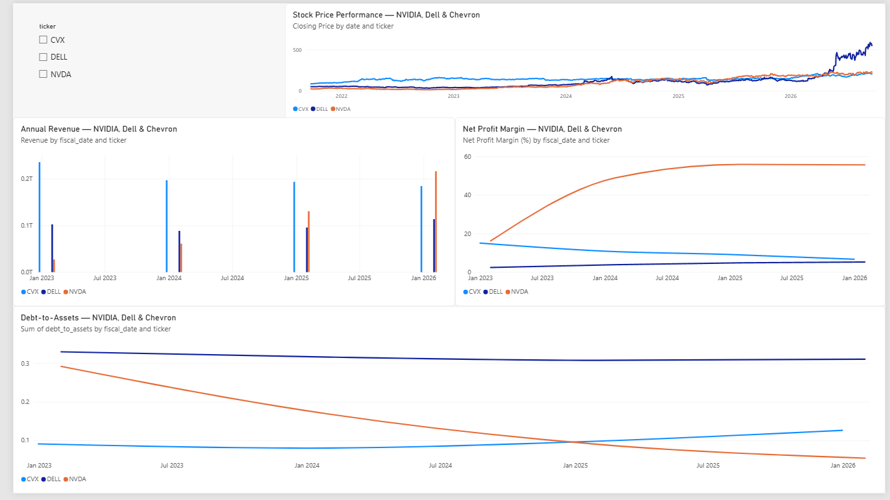

# Automated Financial Data Pipeline & Analytics Dashboard

## Project Overview

This project is an end-to-end financial data engineering and analytics pipeline built with Python, SQL, SQLite, and Power BI.

The pipeline automatically extracts stock market and financial statement data for three publicly traded companies:

- NVIDIA (NVDA)
- Dell Technologies (DELL)
- Chevron (CVX)

The raw data is cleaned, transformed, validated, enriched with financial metrics, and loaded into a SQLite database. SQL queries are then used to analyze the stored data, while Power BI provides an interactive dashboard for exploring stock performance and company financial metrics.

---

## Project Architecture

```text
Yahoo Finance
      |
      v
Python Data Extraction
      |
      v
Raw CSV Files
      |
      v
Data Cleaning & Transformation
      |
      v
Financial Metric Engineering
      |
      v
Data Quality Validation
      |
      v
Processed Datasets
      |
      v
SQLite Database
   /             \
stock_prices   financial_metrics
      |
      v
SQL Analysis
      |
      v
Power BI Dashboard
```

---

## Technologies Used

- Python
- Pandas
- yfinance
- SQL
- SQLite
- Power BI
- VS Code
- Git

---

## ETL Pipeline

The project follows an ETL-style workflow.

### 1. Extract

Python and the yfinance library are used to retrieve approximately five years of historical stock data along with annual financial statements.

The extraction process collects:

- Historical stock prices
- Trading volume
- Income statements
- Balance sheets
- Cash flow statements

### 2. Transform

The raw datasets are cleaned and standardized using Pandas.

Transformation steps include:

- Removing duplicate records
- Converting dates to consistent formats
- Checking important fields for missing values
- Standardizing column names
- Combining company datasets
- Creating calculated financial and market metrics

### 3. Validate

A dedicated validation step checks the processed datasets before they are loaded into the database.

Validation includes:

- Checking for empty datasets
- Detecting duplicate ticker/date records
- Checking critical stock fields for missing values
- Detecting invalid negative trading volume

If critical validation checks fail, the pipeline stops before the data is loaded into SQL.

### 4. Load

The validated datasets are loaded into a SQLite database containing two primary tables:

```text
stock_prices
financial_metrics
```

The database currently contains approximately 3,700+ historical stock-price records and annual financial records for NVIDIA, Dell, and Chevron.

---

## Engineered Stock Metrics

The pipeline calculates several market metrics, including:

- Daily price change
- Daily percentage return
- Daily trading range
- 20-day moving average
- 50-day moving average

These metrics support trend analysis and stock-price comparisons.

---

## Financial Metrics

Financial statement data is used to calculate company performance metrics including:

### Net Profit Margin

Measures how much net income a company generates relative to revenue.

### Operating Margin

Measures operating profitability relative to revenue.

### Current Ratio

Measures short-term liquidity using current assets and current liabilities.

### Debt-to-Assets Ratio

Measures the proportion of company assets financed by debt.

### Return on Assets

Measures net income relative to total assets.

### Revenue Growth

Measures changes in annual revenue between fiscal periods.

---

## SQL Analysis

SQL queries are used to analyze the data stored in SQLite.

Stock analysis includes:

- Number of trading days
- Average closing price
- Minimum closing price
- Maximum closing price

Financial analysis includes:

- Revenue
- Net income
- Net profit margin
- Current ratio
- Debt-to-assets ratio

The SQL analysis demonstrates the use of:

- SELECT
- WHERE
- GROUP BY
- ORDER BY
- COUNT
- AVG
- MIN
- MAX
- ROUND
- Calculated fields
- Column aliases

---

## Power BI Dashboard


An interactive Power BI dashboard was created to visualize both market and financial data.

The dashboard includes:

- Historical stock price performance
- Annual revenue
- Net profit margin
- Debt-to-assets ratio
- Company ticker filtering

Users can compare NVIDIA, Dell Technologies, and Chevron and filter dashboard visuals by company.

---

## Project Structure

```text
financial-data-pipeline/
|
|-- data/
|   |-- raw/
|   |-- processed/
|
|-- database/
|   |-- financial_data.db
|
|-- dashboards/
|   |-- financial_analytics_dashboard.pbix
|
|-- sql/
|   |-- analysis_queries.sql
|
|-- src/
|   |-- extract.py
|   |-- transform.py
|   |-- transform_financials.py
|   |-- validate.py
|   |-- load.py
|   |-- pipeline.py
|   |-- run_queries.py
|
|-- tests/
|
|-- README.md
```

---

## Running the Pipeline

From the main project directory, run:

```bash
python src/pipeline.py
```

The pipeline automatically performs the main workflow:

```text
Extract
   ↓
Transform Stock Data
   ↓
Transform Financial Data
   ↓
Validate
   ↓
Load into SQLite
```

---

## Running the SQL Analysis

Run:

```bash
python src/run_queries.py
```

This queries the SQLite database and displays stock-price and financial-performance analysis in the terminal.

---

## Skills Demonstrated

This project demonstrates practical experience with:

- ETL pipeline development
- Python programming
- Pandas data transformation
- Financial data analysis
- Data cleaning
- Data validation
- Feature and metric engineering
- SQL querying
- Relational database storage
- SQLite
- Power BI dashboard development
- Data visualization
- Pipeline automation
- Financial statement analysis

---

## Future Improvements

Potential future enhancements include:

- Improved API/network error handling
- Automated logging
- Additional data-quality tests
- Scheduled pipeline execution
- Cloud database deployment
- Additional companies and financial metrics

---

## Author

Alex Calderon

Master of Science in Business Analytics  
Finance Concentration
